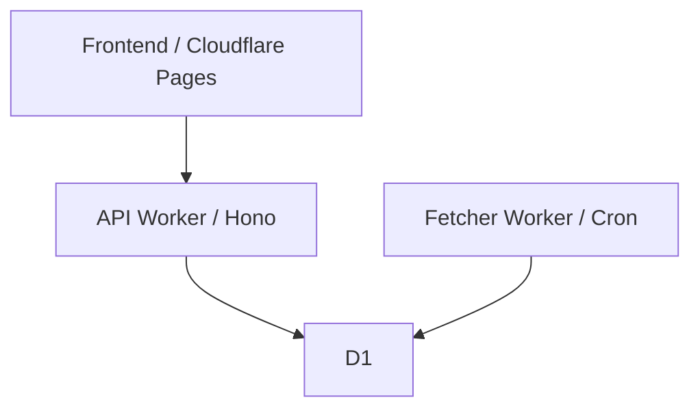

#  ZJU Charger

浙江大学充电桩查询助手。

前端已部署在 Cloudflare Pages；本仓库维护 Cloudflare 原生后端：

- API Worker（Hono）
- Fetcher Worker（Cron）
- D1（SQLite）

## 架构



## API（保持不变）

- `GET /api`
- `GET /api/providers`
- `GET /api/stations`
- `GET /api/status`

## 目录结构

```text
workers/
├── api/                     # Hono API Worker
├── fetcher/                 # Cron Fetcher Worker（每轮从 D1 读取 stations）
├── shared/                  # 共享类型与工具
└── d1/migrations/           # D1 schema/index SQL
```

## 本地开发

```bash
pnpm install
pnpm run api:dev
pnpm run fetcher:dev
pnpm run lint
```

## 部署

```bash
pnpm run fetcher:deploy
pnpm run api:deploy
```

## 自动部署（推荐）

仓库已配置 GitHub Actions：`.github/workflows/workers-deploy.yml`。

- 触发条件：推送到 `main` 且改动 `workers/**`（或相关 lock/workflow 文件）
- 流程：Typecheck → 执行 D1 migrations → 部署 API Worker → 部署 Fetcher Worker
- 你只需 `git push`，无需本地手动 deploy

首次需要在 GitHub 仓库设置 Secrets：

- `CLOUDFLARE_API_TOKEN`
- `CLOUDFLARE_ACCOUNT_ID`

## 文档

- [快速开始](./docs/01-quick-start.md)
- [Cloudflare Workers 部署](./docs/03-server-deployment.md)
- [Fetcher Worker 文档](./docs/04-fetcher.md)
- [D1 数据结构](./docs/07-d1-schema.md)
- [API 参考](./docs/08-api.md)

## 许可证

GPLv3，见 [LICENSE](./LICENSE)。
