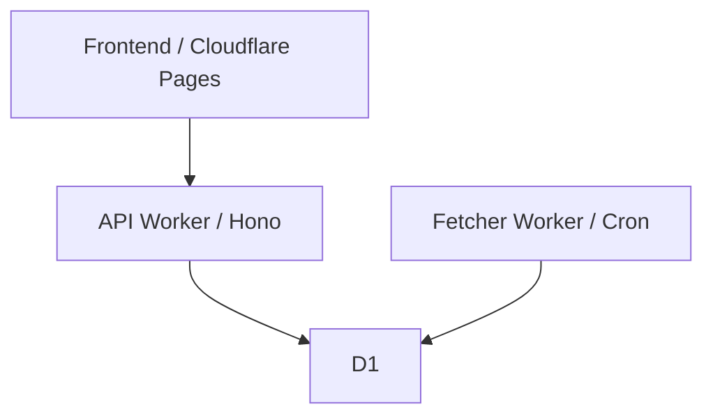

#  ZJU Charger

前端已部署在 Cloudflare Pages；本仓库维护 Cloudflare 原生后端：

## 架构



## 本地开发

```bash
pnpm install
pnpm run api:dev
pnpm run fetcher:dev
pnpm run lint
```

```text
workers/
├── api/                     # Hono API Worker
├── fetcher/                 # Cron Fetcher Worker（每轮从 D1 读取 stations）
├── shared/                  # 共享类型与工具
└── d1/migrations/           # D1 schema/index SQL
```

## 部署

```bash
pnpm run fetcher:deploy
pnpm run api:deploy
```

```shell
PROVIDER_NEPTUNE_JUNIOR_OPENID="token" # nipudun
PROVIDER_NEPTUNE_JUNIOR_UNIONID="token"
PROVIDER_DLMM_TOKEN="token" # dianlvmama
PROVIDER_ELSE_PROVIDER_OPENTOOL_TOKEN="token" # 用电小帮手 多航
PROVIDER_ELSE_PROVIDER_WANCHONG_TOKEN="bearer eyJh123123123"
PROVIDER_ELSE_PROVIDER_WKD_TOKEN="token"
```

## 文档

- [快速开始](./docs/01-quick-start.md)
- [Cloudflare Workers 部署](./docs/03-server-deployment.md)
- [Fetcher Worker 文档](./docs/04-fetcher.md)
- [D1 数据结构](./docs/07-d1-schema.md)
- [API 参考](./docs/08-api.md)

## 许可证

GPLv3，见 [LICENSE](./LICENSE)。
